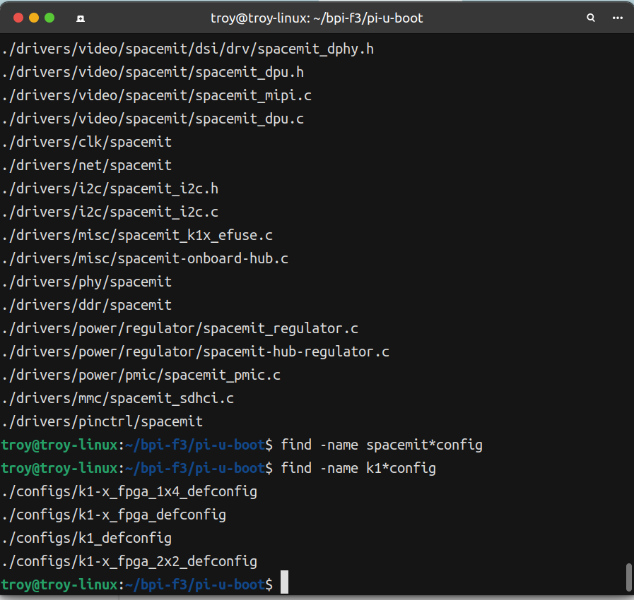

## 环境

```bash
$ sudo apt-get update && sudo apt-get upgrade
$ sudo apt-get install gcc clang rustc bindgen make flex bash  bison pahole mount jfsutils reiserfsprogs xfsprogs  btrfs-progs pcmciautils quota ppp nfs-common grub2-common udev python3-sphinx global build-essential libncurses-dev bison flex libssl-dev libelf-dev bc u-boot-tools
```

你还需要一个针对`riscv`平台的`gcc工具链`:https://github.com/riscv-collab/riscv-gnu-toolchain

## 编译open-sbi

要构建`uboot`，首先需要构建`opensbi`。

首先获取源码:

```bash
git clone git@github.com:BPI-SINOVOIP/pi-opensbi.git && cd pi-opensbi
```

切换到`k1`芯片所对应的分支:

```bash
git checkout v1.3-k1
```

查找一下`spacemit`所对应的平台名称:

```bash
find -name spacemit*

# ./build/platform/generic/kconfig/platform/spacemit
# ./build/platform/generic/spacemit
# ./build/platform/generic/spacemit/spacemit_k1.dep
# ./include/sbi_utils/psci/plat/arm/board/spacemit
# ./platform/generic/include/spacemit
# ./platform/generic/include/spacemit/spacemit_config.h
# ./platform/generic/spacemit
# ./platform/generic/spacemit/spacemit_k1.c
# ./lib/utils/psci/spacemit
# ./lib/utils/psci/spacemit/spacemit_topology.c
# ./lib/utils/arm_scmi/board/spacemit
# ./lib/utils/arm_scmi/board/spacemit/spacemit_pm.c
```

看来`spacemit K1`的文件位于`platform/generic`目录中，因此使用以下命令来构建`opensbi`:

```bash
make CROSS_COMPILE=riscv64-unknown-linux-gnu- PLATFORM=generic -j16
```

遇到了如下错误，看起来是`k1pro`的问题，但问题是我们编译的是`k1`平台下，看来要`menuconfig`了。


幸运的是，我在这里找到了解决方案:https://github.com/BPI-SINOVOIP/pi-opensbi/issues/1

按照`issue`的指导，再次进行编译，得到成功结果，固件路径为`build/platform/generic/firmware/fw_dynamic.bin`


将该文件导出为`OPENSBI`，`uboot`编译要用到:

```bash
export OPENSBI=<your-open-sbi-path>/build/platform/generic/firmware/fw_dynamic.bin
```

## 编译uboot

获取`uboot`源码:

```bash
git clone git@github.com:BPI-SINOVOIP/pi-u-boot.git && cd pi-u-boot && git checkout && git checkout v2022.10-k1
```

通过以下命令可以得知到`config`的名称:

```bash
find -name k1*config
```



所以通过以下命令进行编译`uboot`:

```bash
make ARCH=riscv CROSS_COMPILE=riscv64-unknown-linux-gnu- k1_defconfig && make ARCH=riscv CROSS_COMPILE=riscv64-unknown-linux-gnu- -j16
```

编译后在`uboot`目录下产生了如下文件

```bash
FSBL.bin bootinfo_emmc.bin  bootinfo_sd.bin  bootinfo_spinand.bin bootinfo_spinor.bin u-boot.itb
```

## 加载uboot

将以下文件放入U盘并插入到`bpi-f3`:

- FSBL.bin
- bootinfo_emmc.bin
- u-boot.itb

在`bpi-f3`上执行以下命令:

```bash
mount /dev/sda1 /mnt && cd /mnt

echo 0 > /sys/block/mmcblk2boot0/force_ro
dd if=bootinfo_emmc.bin of=/dev/mmcblk2boot0

dd if=FSBL.bin of=/dev/mmcblk2boot0 bs=512 seek=1
```

使用[mmcblk2_dump.bin](./resources/mmcblk2_dump.bin)覆盖`mmcblk2`分区数据:

```bash
dd if=./mmcblk2_dump.bin of=/dev/mmcblk2 status=progress
```

使用以下命令写入`uboot`:

```bash
dd if=./u-boot.itb of=/dev/mmcblk2p1
```

现在拿掉sd卡，复位后可看到`SPL和Uboot`的输出，重点观察编译时间。

## 加载uboot环境变量

将`env_k1-x.txt`放入`bootfs`中，`uboot`会自动检测并且读取此文件作为环境变量

```bash
mount /dev/mmcblk2p2 /mnt

cp env_k1-x.txt /mnt

umount /mnt
sync
```

