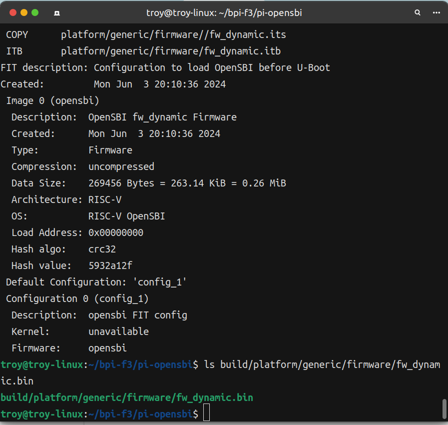

## 环境

```bash
$ sudo apt-get update && sudo apt-get upgrade
$ sudo apt-get install gcc clang rustc bindgen make flex bash  bison pahole mount jfsutils reiserfsprogs xfsprogs  btrfs-progs pcmciautils quota ppp nfs-common grub2-common udev python3-sphinx global build-essential libncurses-dev bison flex libssl-dev libelf-dev bc u-boot-tools
```

你还需要一个针对riscv平台的gcc工具链:https://github.com/riscv-collab/riscv-gnu-toolchain

## 编译open-sbi

要构建uboot，首先需要构建opensbi。

首先获取源码:

```bash
git clone git@github.com:BPI-SINOVOIP/pi-opensbi.git && cd pi-opensbi
```

切换到k1芯片所对应的分支:

```bash
git checkout v1.3-k1
```

查找一下spacemit所对应的平台名称:

```bash
find -name spacemit*

# ./build/platform/generic/kconfig/platform/spacemit
# ./build/platform/generic/spacemit
# ./build/platform/generic/spacemit/spacemit_k1.dep
# ./include/sbi_utils/psci/plat/arm/board/spacemit
# ./platform/generic/include/spacemit
# ./platform/generic/include/spacemit/spacemit_config.h
# ./platform/generic/spacemit
# ./platform/generic/spacemit/spacemit_k1.c
# ./lib/utils/psci/spacemit
# ./lib/utils/psci/spacemit/spacemit_topology.c
# ./lib/utils/arm_scmi/board/spacemit
# ./lib/utils/arm_scmi/board/spacemit/spacemit_pm.c
```

看来spacemit K1的文件位于platform/generic目录中，因此使用以下命令来构建opensbi:

```bash
make CROSS_COMPILE=riscv64-unknown-linux-gnu- PLATFORM=generic -j16
```

遇到了如下错误，看起来是k1pro的问题，但问题是我们编译的是k1平台下，看来要menuconfig了。


幸运的是，我在这里找到了解决方案:https://github.com/BPI-SINOVOIP/pi-opensbi/issues/1

按照issue的指导，再次进行编译，得到成功结果，固件路径为build/platform/generic/firmware/fw_dynamic.bin



将该文件导出为OPENSBI，uboot编译要用到:

```bash
export OPENSBI=<your-open-sbi-path>/build/platform/generic/firmware/fw_dynamic.bin
```

## 编译uboot

获取uboot源码:

```bash
git clone git@github.com:BPI-SINOVOIP/pi-u-boot.git && cd pi-u-boot && git checkout && git checkout v2022.10-k1
```

通过以下命令可以得知到config的名称:

```bash
find -name k1*config
```


所以通过以下命令进行编译uboot:

```bash
make ARCH=riscv CROSS_COMPILE=riscv64-unknown-linux-gnu- k1_defconfig && make ARCH=riscv CROSS_COMPILE=riscv64-unknown-linux-gnu- -j16
```

编译后在uboot目录下产生了如下文件

```bash
FSBL.bin bootinfo_emmc.bin  bootinfo_sd.bin  bootinfo_spinand.bin bootinfo_spinor.bin boot.itb
```

